# 系统架构设计

## 1. 总体架构

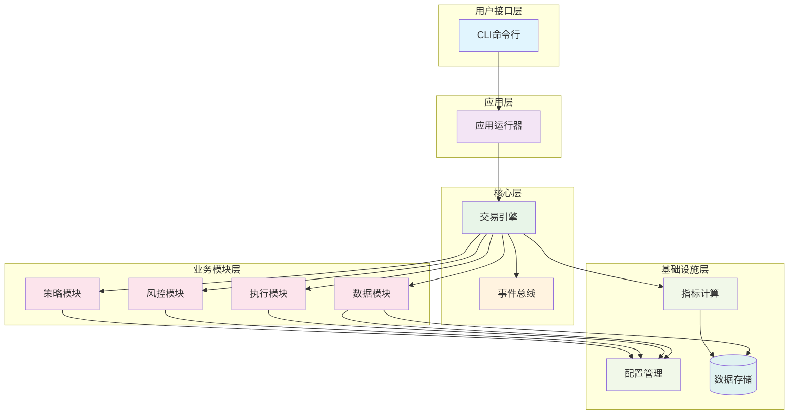

## 2. 核心模块

### 2.1 交易引擎

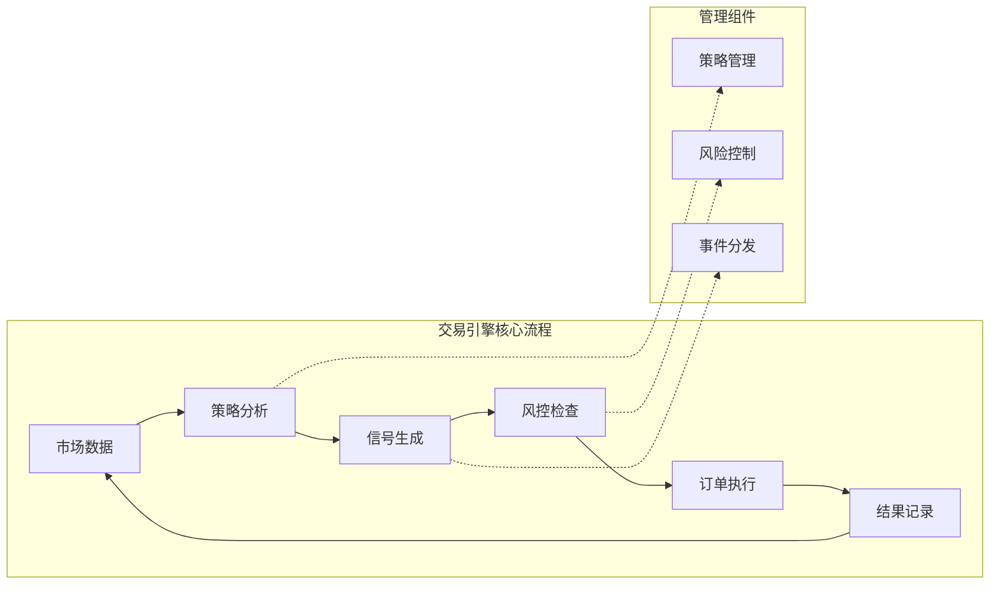

### 2.2 数据模型

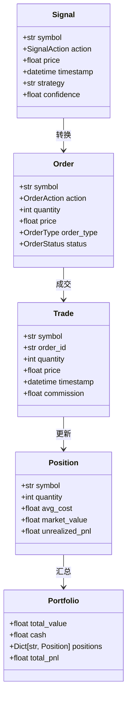

## 3. 业务模块接口

### 3.1 策略模块

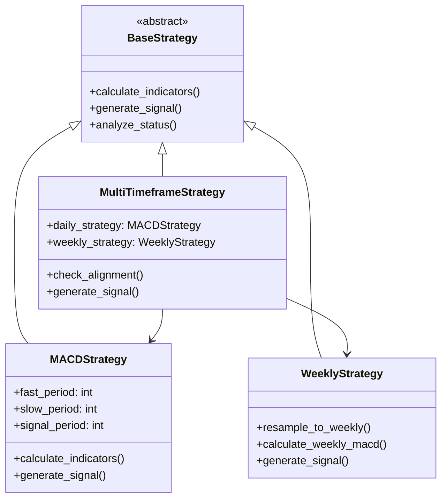

### 3.2 执行器模块

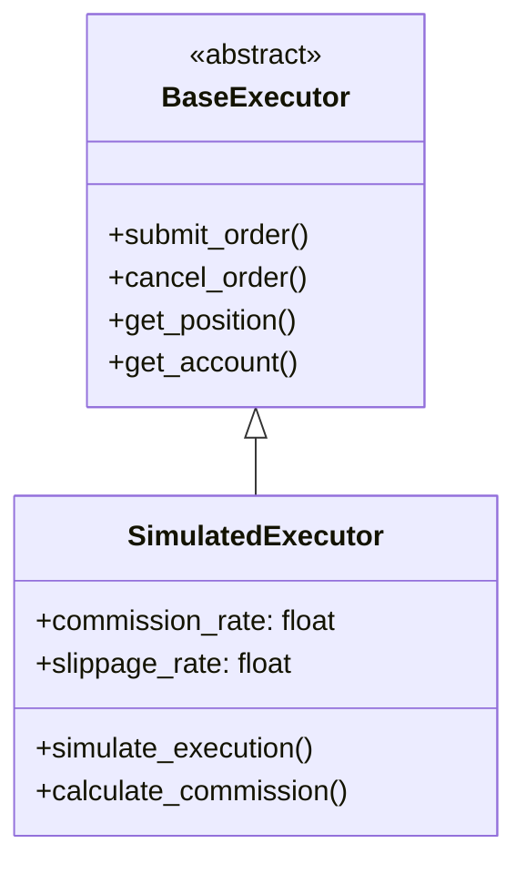

### 3.3 风控模块

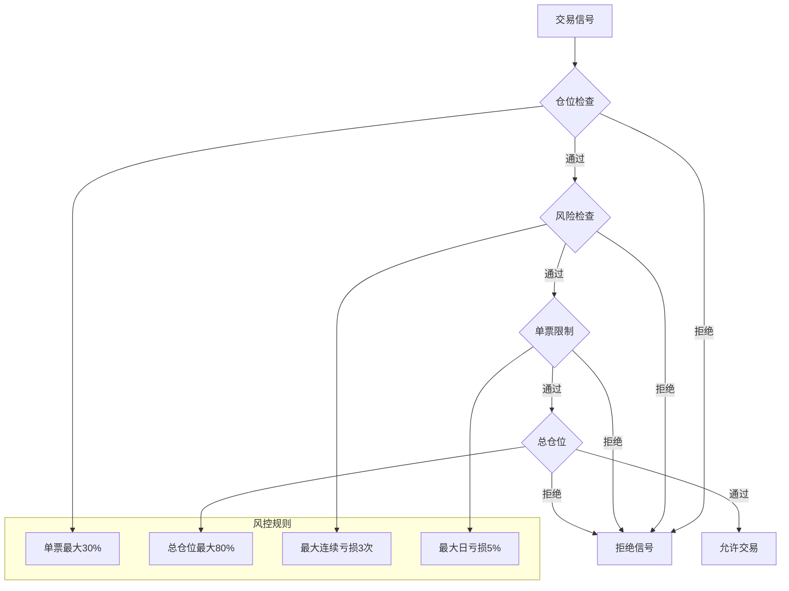

## 4. 数据流架构

### 4.1 回测流程

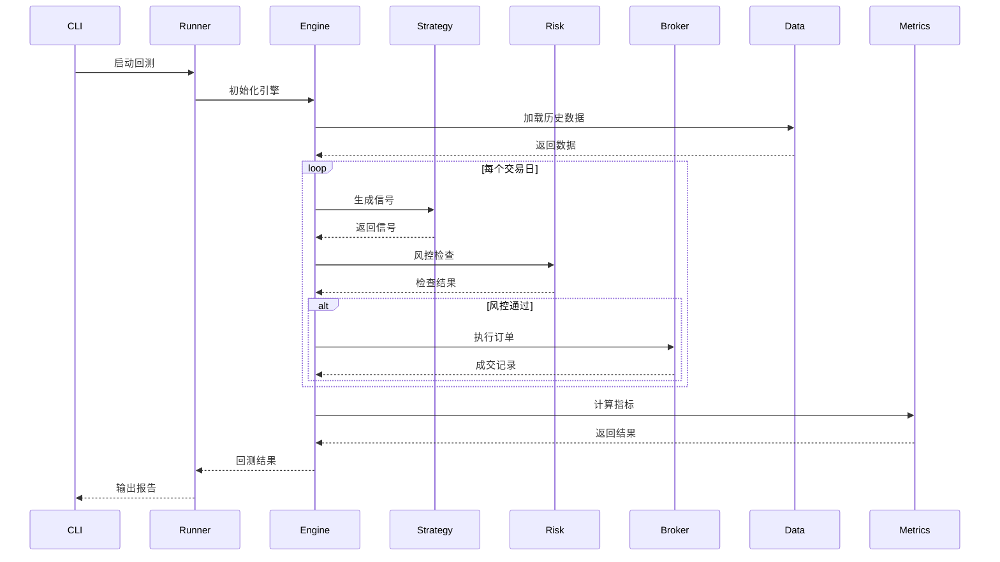

### 4.2 实时监控流程

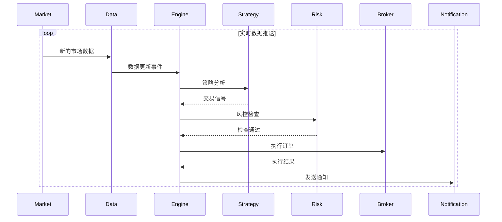

## 5. 配置管理

### 5.1 配置层次结构

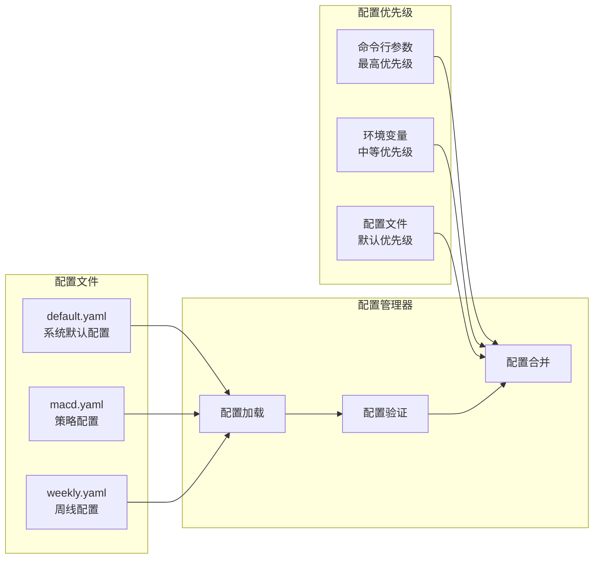

## 6. 事件驱动架构

### 6.1 事件类型和流向

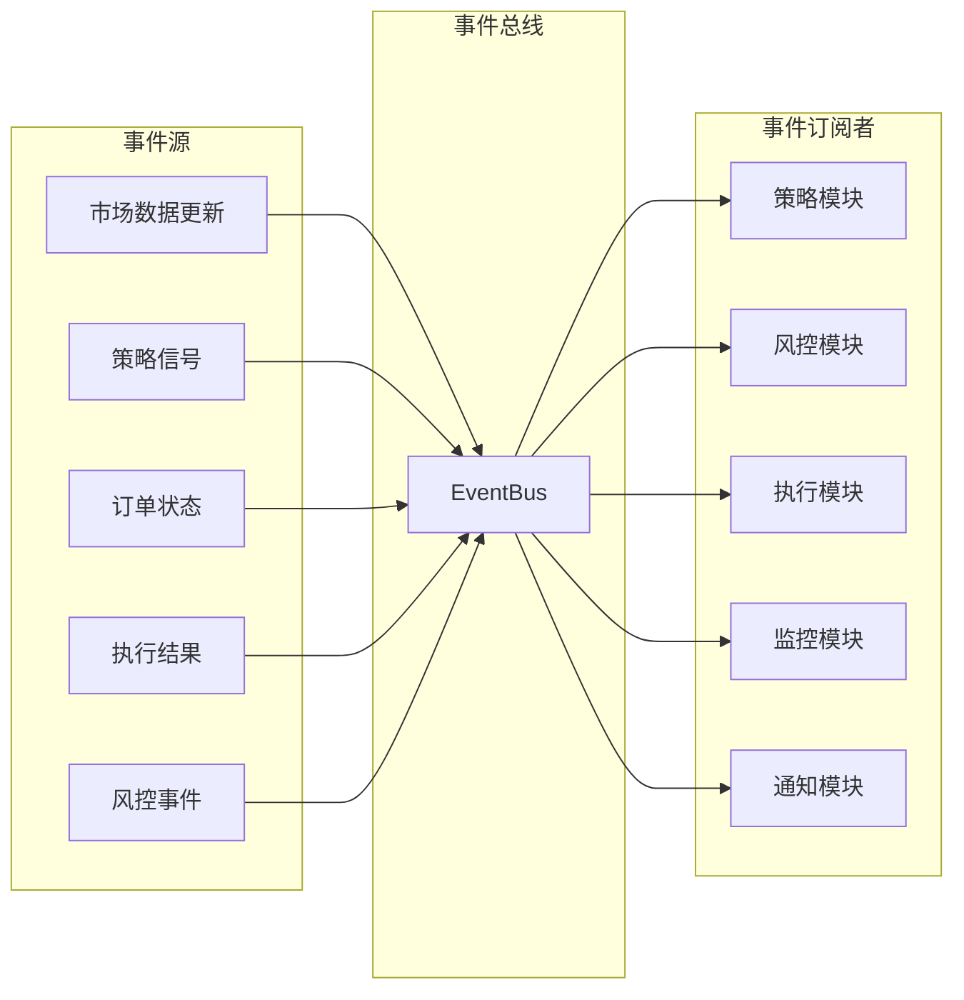

## 7. 性能优化

### 7.1 缓存策略

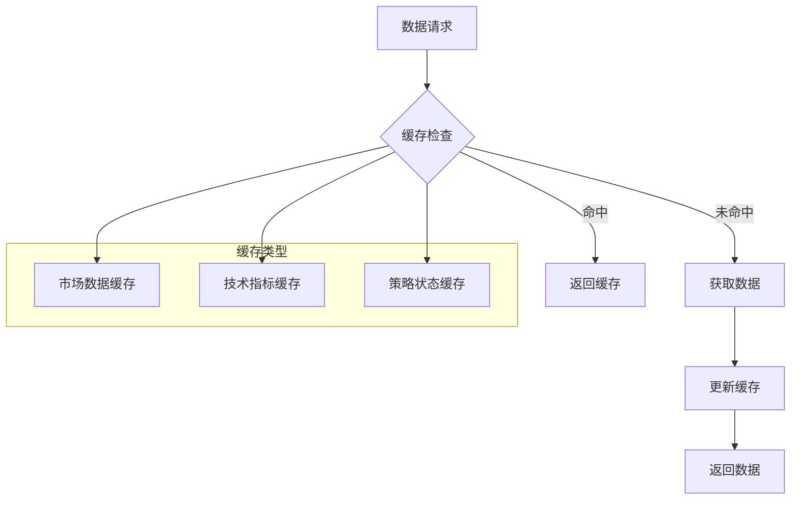

### 7.2 并发处理

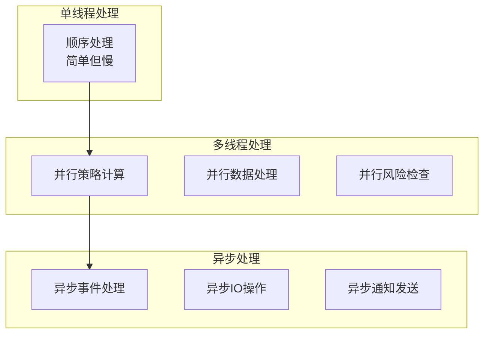

## 8. 安全设计

### 8.1 多层安全检查

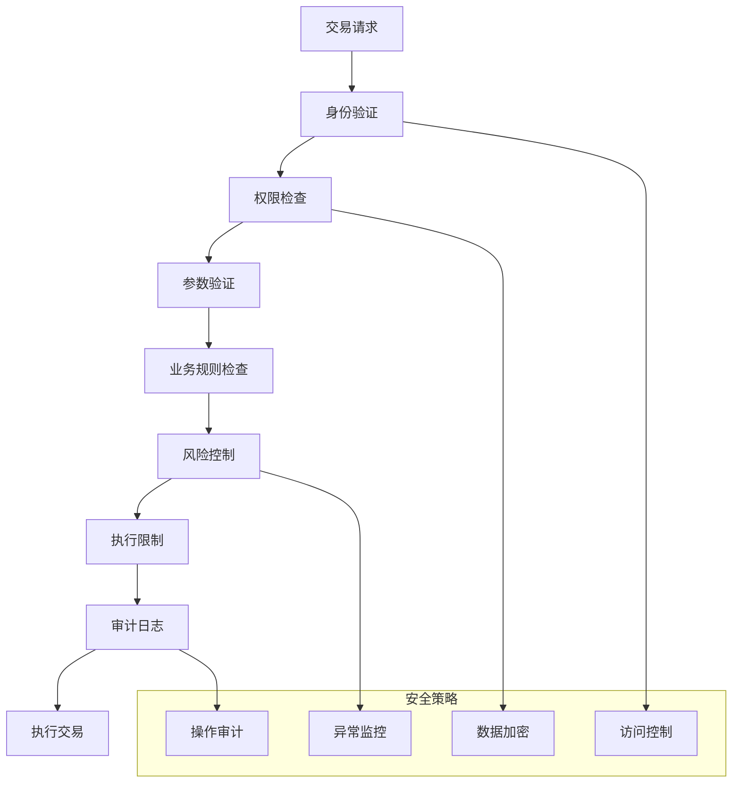

这种 mermaid 图表化的架构设计提供了清晰的视觉表示，便于理解和维护系统的整体结构。